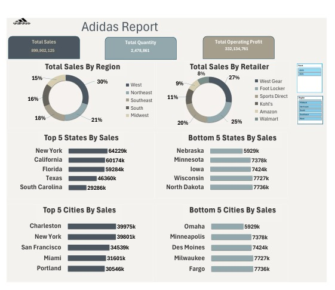
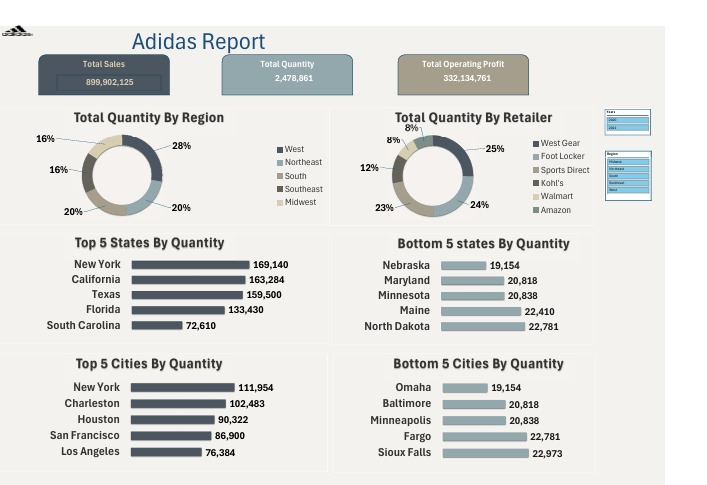
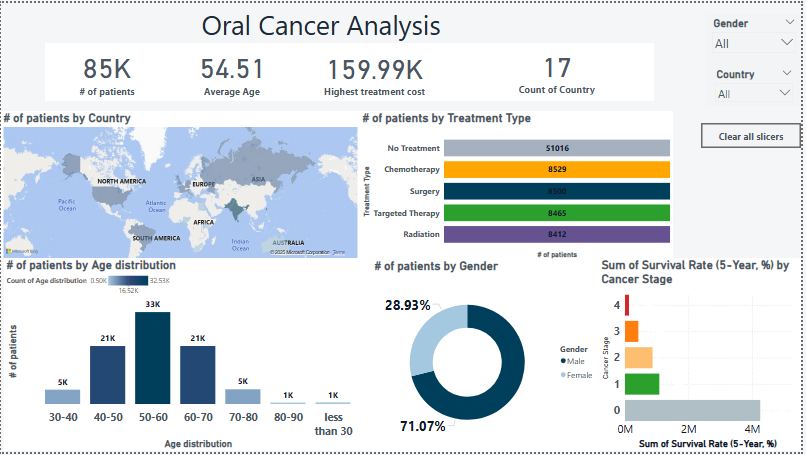
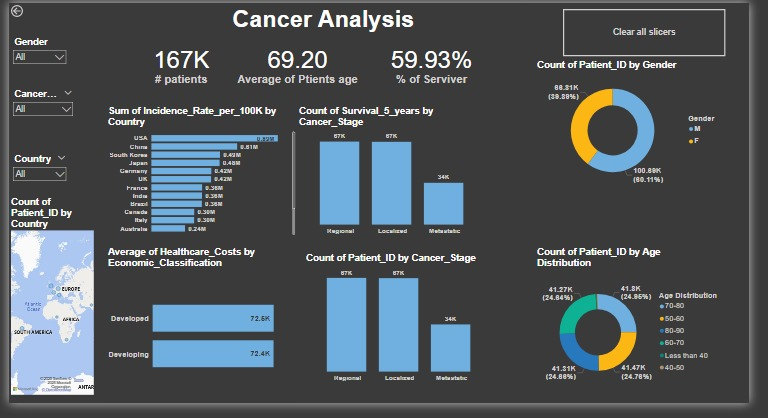
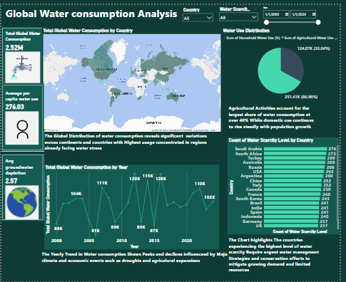

# 📄 Ahmad Yaser - Data Analyst Portfolio

Welcome to my **Data Analyst Portfolio**, where I showcase interactive dashboards and analytical projects created using **Excel**, **Power BI**, **SQL**, and **Python**.  
My background in accounting combined with strong analytical skills allows me to extract insights from raw data and visualize it effectively for decision-making.

---

## 📌 Featured Projects

| Project | Description | Link |
|--------|-------------|------|
| 💧 **Water Consumption Analysis** | Analyzes global water usage, scarcity, and trends over time. | [View Project](https://github.com/ahmadyase1234/Water-analysis-Dashboard-) |
| 📊 **Adidas Sales Dashboard** | Sales performance breakdown by region, state, and retailers. | [View Project](https://github.com/ahmadyase1234/Addidas-Sales-Dashboard) |
| 📦 **Adidas Quantity Analysis** | Visual insights into product quantity and performance gaps. | [View Project](https://github.com/ahmadyase1234/Adidas-quantity-analysis-) |
| 🧬 **Oral Cancer Analysis** | Patient demographics, treatments, and survival data. | [View Project](https://github.com/ahmadyase1234/oral-cancer-analysis) |
| 🩺 **Cancer Dashboard** | Country-wide cancer data and trends by age and gender. | [View Project](https://github.com/ahmadyase1234/Cancer-analysis-dashboard-) |
| 🥗 **Nutrition Analysis** | Nutritional breakdown of food items and caloric distribution. | [View Project](https://github.com/ahmadyase1234/nutrition-analysis) |
| 🌍 **Environmental Trends** | Global climate data including CO₂, sea levels, and energy use. | [View Project](https://github.com/ahmadyase1234/global-environmental-trends) |

---

## 🔧 Tools & Skills

- **Power BI** – Dashboard creation and data storytelling  
- **Excel** – Pivot tables, charts, cleaning  
- **SQL** – Data extraction and joins  
- **Python (pandas, matplotlib)** – Data manipulation and visualizations  
- **GitHub** – Version control and project sharing  
- **HTML/CSS** – Personal portfolio design  

---

## 🖼️ Portfolio Screenshots

You can preview selected dashboards directly in the portfolio or via the GitHub pages if hosted.

### 📊 Adidas Sales Dashboard  

### 📦 Adidas Quantity Analysis  

### 🧬 Oral Cancer Analysis  

### 🩺 Cancer Dashboard  

### 🌍 Global Environmental Trends  

### 🥗 Nutrition Analysis  

### 💧 Water Dashboard  

---

## 📬 Contact

- 📧 Email: ahmadyaser17199813@gmail.com  
- 💼 LinkedIn: [linkedin.com/in/ahmad-yasser-faiq-data-analyst](https://www.linkedin.com/in/ahmad-yasser-faiq-data-analyst/)  
- 🖥️ GitHub: [github.com/ahmadyase1234](https://github.com/ahmadyase1234)  
- 📱 Phone: 01094104923 / 01555313788
- 👉 **Live Portfolio**: [Click Here to View Online](https://ahmadyase1234.github.io/)
